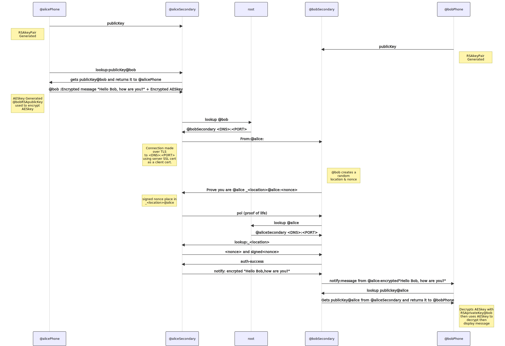

# Hi there I'm Colin Constable, my @sign is @colin
## Work
 In mid 2019 together with three friends we started Atsign, our plan to change the world through a new Internet protocol. It was a crazy idea, we had no code just a simple question, "what is the simplest way to assert an identity on the internet?". The answer a simple string, what we call an atSign now, where the owner can mange their own data behind the @sign and allow others to access it under their control.
  We started writing demo code in Dart and found it perfect for having a single code base across, x86, ARM and ARM64, as we wanted our protocol to run natively on everything from lightbulbs to cloud servers. 
  We quickly found that whilst people loved the idea of the protocol not everyone wanted to or needed to know every verb we had built into it. So we started building and SDK that abstracted the underlying protocol to what seemed to the developer like a global limitless key value database.
  Once the SDK was stumbling we started extending to the Flutter framework and that's when we got involved in the amazing global Flutter community a vibrant source of like minded innovators. 
  Dart/Flutter is awesome and we see so many ideas from developers that should be in the world but they often stumble on the complexities and costs of the backend infrastructure. 
  The SDK and underlying atPlatform allows developers to produce end to end encrypted applications, that need no infrastructure for the developer to manage or deploy.
  We have of course open sourced everything and it can be found [here](https://github.com/atsign-foundation), along with our [dev site](https://atsign.dev) and our [website](https://atsign.com) and registrar site for @signs, which are free or paid.
## The @ Protocol
Overview of the interactions (Mermaid source [here](./overview.mermaid)).

## History
My background is in large scale infrastructure, networking and security. My full history is detailed on [LinkedIn](https://www.linkedin.com/in/colinconstable/)
<!--
**cconstab/cconstab** is a ✨ _special_ ✨ repository because its `README.md` (this file) appears on your GitHub profile.

##About me
Check out my [@colin](https://atsign.directory/@colin) page

Here are some ideas to get you started:

- 🔭 I’m currently working on ...
- 🌱 I’m currently learning ...
- 👯 I’m looking to collaborate on ...
- 🤔 I’m looking for help with ...
- 💬 Ask me about ...
- 📫 How to reach me: ...
- 😄 Pronouns: ...
- ⚡ Fun fact: ...
-->
